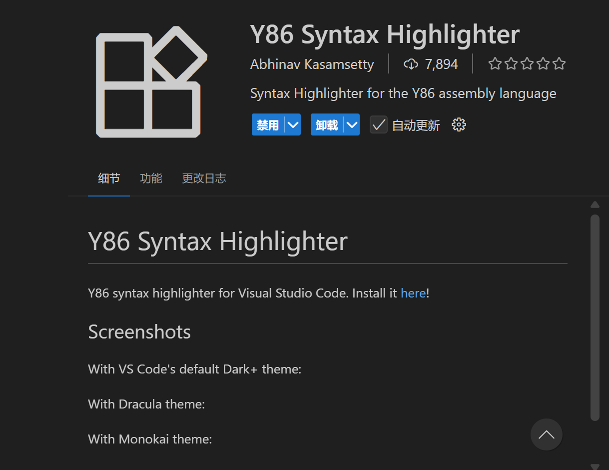

>**⚠ 警告**
>
>**该博客仅供参考，请勿抄袭，后果自负**
***
因为PKU在2024年对archlab进行了重新构建，所以A大的博客有一些与目前版本不对应的地方，所以参考A大的博客进行了撰写
这是本人第一次写博客，若有不足之处，请谅解
致谢：
[Arthal的博客]https://arthals.ink/blog/arch-lab
# Part A
本阶段任务并没有对旧版进行太大的更改，需要做的是在`./archlab-project/misc`中修改三个`.ys`文件，并通过执行
```bash
./yas xxx.ys && ./yis xxx.yo
```
来运行这三个`.ys`文件，同时，你也可以用
```bash
export PATH=$PATH:/home/ubuntu/archlab-handout/archlab-project/target/debug
```
来暂时将grader的目录加入环境变量后运行
```bash
grader part-a
```
来为你的partA评分。
此外，推荐下载 VS Code Y86 语法扩展以获得高亮编码体验：
  
对于这部分的代码，更详细的思路分析可以去看A神的博客。
[Arthal的博客]https://arthals.ink/blog/arch-lab
## sum.ys

  对sum.c进行逐步地分析后得到以下代码

```asm
 	.pos 0 
	irmovq stack, %rsp  	# Set up stack pointer  
	call main		# Execute main program
	halt			# Terminate program 

# 示例链表（按8字节对齐）
.align 8
ele1:    # 第一个链表节点
.quad 0x00d  # 指向第二个节点（ele2）的指针（8字节）
.quad ele2 # 节点存储的值（8字节，十六进制）
ele2:    # 第二个链表节点
.quad 0x0e0 # 节点存储的值（8字节，十六进制）
.quad ele3  # 指向第三个节点（ele3）的指针（8字节）
ele3:    # 第三个链表节点
.quad 0xf00 # 节点存储的值（8字节，十六进制）
.quad 0     # 指向空地址（表示链表结尾）

main:
	irmovq ele1,%rdi	# 将参数移入对应寄存器
	call sum_list		
	ret 
sum_list:
    pushq %rbx  # 保存rbp
    xorq %rax,%rax  # rax置零
    jmp test    # 判断循环

loop:# 循环部分
    mrmovq (%rdi),%rsi  # Y86中不支持立即数加法，所以要把得到的数值先存入寄存器
    addq %rsi,%rax
    mrmovq 8(%rdi),%rdi #指针++

test:
    andq %rdi,%rdi  # 判断地址是否为0
    jne loop
    popq %rbx
    ret

# The stack starts here and grows to lower addresses
	.pos 0x200		
stack:	
```

这里比较坑的一点是，文件中并没有给出栈初始化和主函数代码，所以如果只实现了`sum_list`函数是无法运行的，栈初始化和主函数的代码可以参考`./archlab-project/misc/y86-code`中的`.ys`文件。
## rsum.ys
  
本题要求我们实现递归的累加函数，思路是将得到的数值加入栈中然后递归调用`rsum_list`,再将栈中数值弹出。
具体代码如下：
```asm
 	.pos 0 
	irmovq stack, %rsp  	# Set up stack pointer  
	call main		# Execute main program
	halt			# Terminate program 

# 示例链表（按8字节对齐）
.align 8
ele1:    # 第一个链表节点
.quad 0x00d  # 指向第二个节点（ele2）的指针（8字节）
.quad ele2 # 节点存储的值（8字节，十六进制）
ele2:    # 第二个链表节点
.quad 0x0e0 # 节点存储的值（8字节，十六进制）
.quad ele3  # 指向第三个节点（ele3）的指针（8字节）
ele3:    # 第三个链表节点
.quad 0xf00 # 节点存储的值（8字节，十六进制）
.quad 0     # 指向空地址（表示链表结尾）

main:
	irmovq ele1,%rdi	
	call rsum_list		
	ret 
rsum_list:
    andq %rdi,%rdi  # 判断指针是否为空，若为空则return 0
    je base
    mrmovq  (%rdi),%rdx # 取值
    mrmovq 8(%rdi),%rdi # 指针++
    pushq %rdx  #将得到的数值压入栈中
    call rsum_list  #递归调用
    popq %rdx   # 将栈的值弹出
    addq %rdx,%rax
    ret
base:
    xorq %rax,%rax # rax置0，即return 0
    ret

# The stack starts here and grows to lower addresses
	.pos 0x200		
stack:	 
```
## bubble.ys
```asm
	.pos 0
	irmovq	stack,%rsp
	call main
	halt

	.align 8
array:
	.quad 0xbca
	.quad 0xcba
	.quad 0xacb
	.quad 0xcab
	.quad 0xabc
	.quad 0xbac
# rdi *data rsi count
bubble_a:
	irmovq $8,%r8
	irmovq $1,%r9   #将需要的立即数先移入寄存器
	rrmovq %rdi,%rcx    # rcx=last
	rrmovq %rsi,%r10    # r10=i
	subq %r9,%r10
rcx_loop:   # 将last累加（count-1）次8，last=last = data + count - 1
	addq %r8,%rcx
	subq %r9,%r10
	jg rcx_loop
out_loop:
	rrmovq %rdi,%rdx
in_loop:
	mrmovq (%rdx),%r11
	mrmovq 8(%rdx),%r12
	rrmovq %r11,%r13
	subq %r12,%r13
	jle no_swap
	rrmovq %r12,%r13
	rrmovq %r11,%r12
	rmmovq %r12,8(%rdx)
	rmmovq %r13,(%rdx)
no_swap:
	addq %r8,%rdx
	rrmovq %rcx,%r10
	subq %rdx,%r10
	jg in_loop
	subq %r8,%rcx
	rrmovq %rcx,%r10
	subq %rdi,%r10
	jg out_loop
	ret

main:
	irmovq array,%rdi
	irmovq $6,%rsi
	call bubble_a
	ret

	.pos 0x200
stack:
```